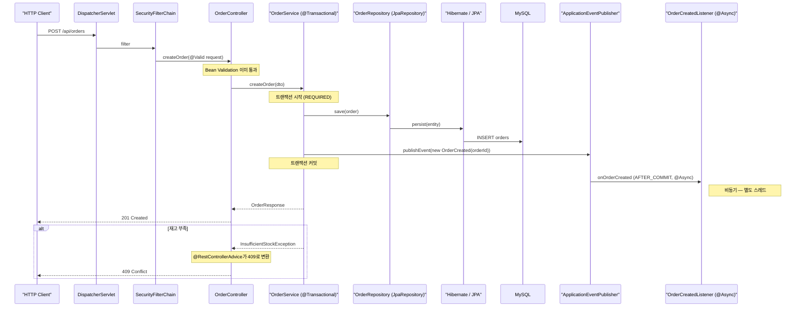
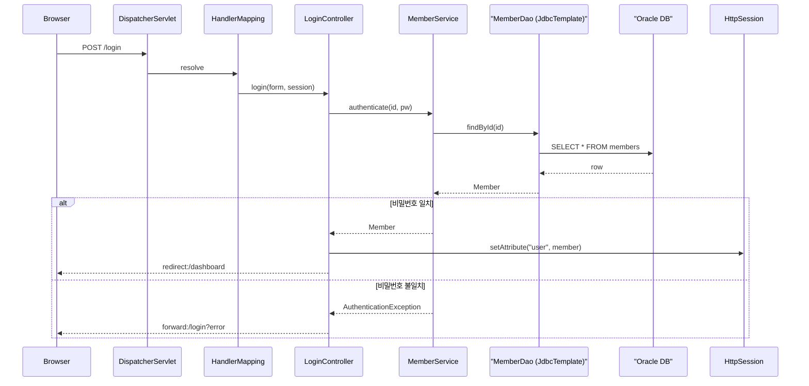

# Java / Spring Boot 코드 분석 힌트

이 파일은 `code-analyzer` 스킬이 **Java 17+ / Spring Boot 2.7~3.x** 프로젝트를 분석할 때 참조한다. 레거시 Spring Framework(5.x) 패턴, Java 17 `record`/`var`·Jakarta EE 전환(`javax` → `jakarta`), Lombok 사용 프로젝트까지 포함한다.

## 읽기 타이밍

SKILL.md 1단계에서 언어 감지 후, 다음 중 하나 이상이면 이 파일을 읽은 뒤 2단계로 진행한다:

- `build.gradle` / `build.gradle.kts` / `pom.xml` 존재
- `src/main/java/` 디렉터리 존재 + `.java` 파일 5개 이상
- `application.yml` / `application.properties` 존재 (Spring Boot)

`build.gradle`/`pom.xml`의 `spring-boot-starter-*` 의존성 존재 여부로 Spring Boot 모드를 판단한다. `spring-boot-starter-data-jpa` → JPA 경로, `spring-boot-starter-webflux` → Reactive 경로를 별도로 표시한다.

---

## 진입점 식별

### Spring Boot 애플리케이션

1. **`@SpringBootApplication` 클래스** — `public static void main(String[] args)`를 가진 단일 진입점. `*Application.java` 네이밍이 관례이지만 강제는 아님.
2. **`*Controller` 클래스** — `@RestController` 또는 `@Controller`가 달린 HTTP 진입점. 실질적 분석 시작점은 여기다.
3. **`@RequestMapping` / `@GetMapping` / `@PostMapping`** — 엔드포인트 URL 매핑. 이 애노테이션을 `rg -n`으로 검색해 URL → 메서드 매핑을 복원.
4. **`@EventListener` / `@Scheduled` / `@KafkaListener`** — 비동기·스케줄·메시지 진입점. HTTP 밖의 진입점이므로 누락되지 않도록 별도 검색한다.
5. **`CommandLineRunner` / `ApplicationRunner` 빈** — 애플리케이션 기동 시 실행되는 초기화 훅.

### Spring Framework 5.x 레거시

1. `web.xml` 또는 `WebAppInitializer` 클래스 — DispatcherServlet 등록
2. `@EnableWebMvc` 설정 클래스 — MVC 활성화 지점
3. `*Controller` — `@Controller` + JSP/Thymeleaf 반환 혹은 `@ResponseBody` 분기 확인

---

## 레이어 구조 (Spring Boot 표준)

다이어그램 작성 시 이 순서대로 화살표를 그린다:

```
Client → DispatcherServlet → Filter → Interceptor → Controller → (Validation) → Service → Repository → DB
                                                           ↓
                                                     Event Publisher (@EventListener)
                                                           ↓
                                                     Async / Scheduled / Kafka Listener
```

| 레이어 | 경로 관례 | 역할 | 감지 애노테이션 |
|---|---|---|---|
| Controller | `*Controller.java` | HTTP 진입. 얇게 유지 | `@RestController`, `@Controller`, `@RequestMapping` |
| Service | `*Service.java` | 비즈니스 로직. 트랜잭션 경계 | `@Service`, `@Transactional` |
| Repository | `*Repository.java` | JPA/MyBatis 데이터 접근 | `@Repository`, `extends JpaRepository<T, ID>` |
| Domain/Entity | `*.java` (domain/entity 패키지) | JPA 엔티티 또는 도메인 객체 | `@Entity`, `@Table` |
| DTO | `*.java` (dto 패키지, record 많음) | 입출력 값 객체 | `record`, `@JsonProperty` |
| Config | `*Config.java` | Spring Bean 설정 | `@Configuration`, `@Bean` |
| Exception | `*Exception.java` | 도메인 예외 | `extends RuntimeException`, `@ResponseStatus` |
| Exception Handler | `*ExceptionHandler.java` | 전역 예외 변환 | `@RestControllerAdvice`, `@ExceptionHandler` |
| Security | `SecurityConfig.java`, `*Filter.java` | 인증·인가 | `@EnableWebSecurity`, `SecurityFilterChain` |
| Async / Event | `*Listener.java`, `*EventHandler.java` | 이벤트·비동기 | `@EventListener`, `@Async`, `@Scheduled` |

---

## 검색 패턴 치트시트

Java/Spring 특화 패턴. SKILL.md 2단계의 일반 검색 대신 사용한다.

| 찾을 대상 | `rg -n` 패턴 |
|---|---|
| 클래스/인터페이스/열거/record | `^(public \|abstract \|final )*(class \|interface \|enum \|record )` |
| 메서드 (public/private/protected/package) | `^\s*(public \|private \|protected )?(static \|final \|abstract )?[A-Za-z<>\[\], ]+\s+[a-z][A-Za-z0-9_]*\s*\(` |
| import | `^import ` |
| package 선언 | `^package ` |
| Spring stereotype | `@(RestController\|Controller\|Service\|Repository\|Component\|Configuration)` |
| HTTP 매핑 | `@(Request\|Get\|Post\|Put\|Delete\|Patch)Mapping` |
| JPA 엔티티·관계 | `@(Entity\|Table\|OneToMany\|ManyToOne\|ManyToMany\|OneToOne\|JoinColumn\|FetchType)` |
| 트랜잭션 | `@Transactional` |
| 검증 | `@(Valid\|Validated\|NotNull\|NotBlank\|Size\|Pattern\|Min\|Max)` |
| 이벤트 | `@EventListener\|ApplicationEventPublisher\|publishEvent\(` |
| 비동기/스케줄 | `@(Async\|Scheduled\|KafkaListener\|RabbitListener)` |
| 보안 | `@(PreAuthorize\|PostAuthorize\|Secured\|RolesAllowed)\|SecurityFilterChain` |
| Lombok | `@(Data\|Getter\|Setter\|Builder\|RequiredArgsConstructor\|NoArgsConstructor)` |
| 예외 처리 | `@(ExceptionHandler\|RestControllerAdvice\|ControllerAdvice\|ResponseStatus)` |
| 설정 값 주입 | `@Value\(\|@ConfigurationProperties` |
| DI 생성자 | `public\s+[A-Z][A-Za-z0-9_]*\s*\(.*\)\s*\{` (클래스 이름과 동일한 메서드) |
| Feign/WebClient 외부 호출 | `@FeignClient\|WebClient\.\|RestTemplate\.` |

`rg -n` 검색 시 `javax.persistence` (레거시) vs `jakarta.persistence` (Spring Boot 3+)로 버전을 함께 확인한다.

---

## 비즈니스 로직 분석 시 주의점

### `@Transactional` 경계

- **클래스 레벨 vs 메서드 레벨**: 클래스 레벨은 모든 public 메서드에 전파. 메서드 레벨이 더 강한 우선권. `readOnly = true`는 INSERT/UPDATE 방지 + 쿼리 최적화 힌트.
- **`propagation` 속성**: 기본은 `REQUIRED`. `REQUIRES_NEW`는 별도 트랜잭션 분기, `SUPPORTS`는 기존 트랜잭션에 참여 또는 비트랜잭션 실행. 다이어그램에 트랜잭션 경계를 별도 블록으로 표시하면 의미가 드러난다.
- **Self-invocation 함정**: 같은 클래스의 non-`@Transactional` 메서드가 `@Transactional` 메서드를 호출하면 프록시를 우회해 트랜잭션이 열리지 않는다. 분석 중 발견되면 섹션 4(참고 사항)에 기록.

### JPA Dirty Checking과 Cascade

- **`save()` 없이 UPDATE 발생**: 영속 상태의 엔티티 필드를 변경하고 트랜잭션이 끝나면 자동 UPDATE. `repository.save()` 호출이 없어도 변경이 반영됨을 흐름 설명에 명시.
- **Lazy fetch와 N+1**: `@ManyToOne(fetch = LAZY)` 기본. 컬렉션 루프에서 연관 엔티티 접근 시 N+1 쿼리. 발견되면 섹션 4에 "N+1 의심 — performance-profiler 분석 권장"으로 핸드오프.
- **LazyInitializationException**: 트랜잭션 밖에서 Lazy 연관 접근 시 발생. 컨트롤러 레벨에서 엔티티를 직접 반환하고 DTO 변환을 뷰에 맡기면 터진다.
- **Cascade 연산**: `CascadeType.ALL`/`PERSIST`/`REMOVE`는 상위 엔티티 저장/삭제가 하위로 전파. 의존성 다이어그램에 cascade 방향을 표시.

### Spring Security

- **필터 체인 순서**: `SecurityFilterChain` 빈의 `authorizeHttpRequests` 순서가 실제 평가 순서. 위에서 아래로 매칭되며 첫 매치 승.
- **`@PreAuthorize` / `@Secured`**: AOP로 가로챔. Controller/Service 메서드 시그니처만 보고 접근 권한을 추정하지 말고 애노테이션을 반드시 확인.
- **익명 접근 경로**: `permitAll()`로 열린 엔드포인트는 섹션 4에 별도 나열.

### 예외 처리

- **`@RestControllerAdvice`의 `@ExceptionHandler`**: 예외 타입 → HTTP 상태 매핑이 여기서 결정. 이 클래스가 범위 밖이면 기본 500이 나간다는 점을 섹션 4에 기록.
- **`@ResponseStatus` 애노테이션**: 커스텀 예외 클래스에 직접 상태 코드를 박는 패턴. 이것과 `@ControllerAdvice`가 공존하면 애드바이스가 우선.

### Spring Boot 3 전환 주의

- **`javax.*` → `jakarta.*`**: Spring Boot 3부터 Jakarta EE 10으로 전환. `javax.persistence.Entity`는 레거시, `jakarta.persistence.Entity`가 현재.
- **`@EnableAutoConfiguration` 메타데이터**: Spring Boot 3에서 `META-INF/spring.factories` → `META-INF/spring/org.springframework.boot.autoconfigure.AutoConfiguration.imports`로 이동.
- **Native image 지원**: GraalVM native image 빌드가 있으면 `@Reflective`, `@RegisterReflectionForBinding` 애노테이션이 등장할 수 있다.

### 비동기 / 이벤트

- **`ApplicationEventPublisher.publishEvent(...)`**: 기본 동기. `@Async`를 리스너에 붙이면 비동기가 되며 이때 트랜잭션 바깥에서 실행된다.
- **`@TransactionalEventListener(phase = AFTER_COMMIT)`**: 트랜잭션 커밋 후에만 리스너 실행. 결제·알림 흐름에서 자주 등장.
- **`@Scheduled(cron = "...")`**: 스케줄 표현식에서 타임존 누락 시 서버 로컬 타임존. 다이어그램에는 "스케줄러" participant로 별도 표시.

### Lombok 주의

- **`@Data`**는 equals/hashCode/toString을 자동 생성하는데, **JPA 엔티티에 붙이면 양방향 관계에서 StackOverflow 위험**. 엔티티에 `@Data`가 보이면 섹션 4에 기록.
- **`@Builder`**는 모든 필드에 대한 빌더를 만든다. 필수/선택 필드 구분이 시그니처로 드러나지 않음.
- **`@RequiredArgsConstructor`**: `final` 필드로 생성자 DI를 자동 생성. 생성자 시그니처가 코드상에 보이지 않아 검색으로 찾을 때 주의.

---

## 시퀀스 다이어그램 participant 네이밍

실제 클래스명을 그대로 쓰되, Spring Boot의 경우 역할을 괄호로 병기하면 가독성이 좋다.

### Spring Boot 예시 (주문 생성)



### 레거시 Spring MVC 예시



Client가 임의 HTTP 클라이언트(curl/Postman/SPA 등)라 구체명을 특정할 수 없으면 `participant Client as "HTTP Client"` 패턴을 사용한다.

---

## 분석 깊이 조정 (Java/Spring 한정)

Spring Boot 프로젝트는 Gradle/Maven 캐시와 생성 소스가 파일 수를 부풀린다. SKILL.md 1단계의 분석 깊이 기준(10/11-30/30+)을 적용할 때 **다음은 카운트에서 제외**한다:

- `build/`, `out/`, `target/` — 빌드 산출물
- `.gradle/`, `.mvn/` — 빌드 도구 캐시
- `src/main/generated/`, `build/generated/sources/` — 어노테이션 프로세서 생성 코드 (Lombok, QueryDSL, MapStruct)
- `src/test/` — 별도 분석 요청이 없는 한 제외
- `src/main/resources/` — 설정·템플릿·정적 자산 (application.yml, static/, templates/)
- `src/main/webapp/` (레거시) — JSP·정적 자산

실질적 분석 대상은 `src/main/java/` + 설정 빈 클래스 정도다.

QueryDSL의 `Q*.java`, MapStruct의 `*MapperImpl.java`는 빌드 시 생성되므로 `build/generated/`에 있다면 카운트 제외. 소스에 직접 체크인됐다면 보조 분석 대상(목록만).
