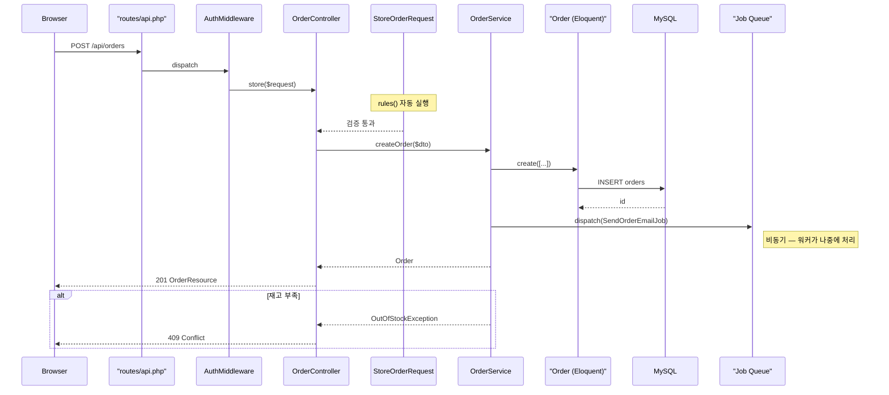
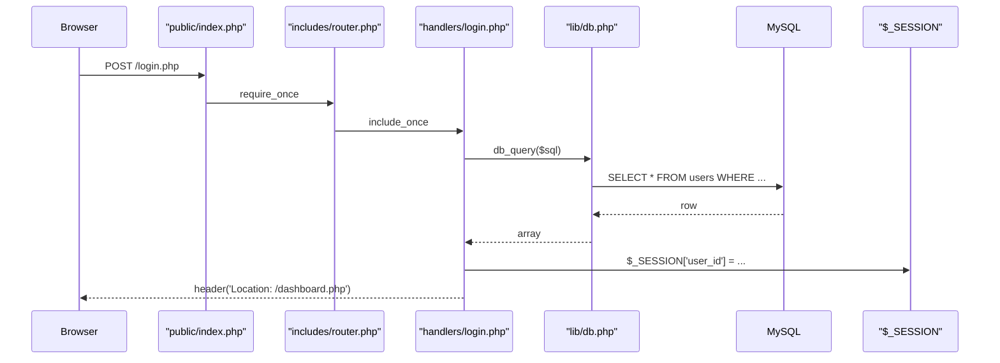

# PHP 코드 분석 힌트 (PHP 5.6 / PHP 8.3 + Laravel 10)

이 파일은 `code-analyzer` 스킬이 PHP 프로젝트를 분석할 때 참조한다. 레거시 **PHP 5.6** 패턴과 모던 **PHP 8.3 + Laravel 10** 컨벤션을 모두 다룬다. 두 스타일이 한 저장소에 혼재할 수 있다는 전제로 작성되었다.

## 읽기 타이밍

SKILL.md 1단계에서 언어 감지 후, 다음 중 하나 이상이면 이 파일을 읽은 뒤 2단계로 진행한다:

- `composer.json` 파일 존재
- `artisan` 스크립트 존재 (Laravel)
- `bootstrap/app.php` 존재 (Laravel)
- `.php` 확장자 파일이 범위 내 5개 이상

`composer.json`의 `require.laravel/framework` 존재 여부로 Laravel 모드, `require.php` 필드로 지원 PHP 버전을 판단한다.

---

## 진입점 식별

### Laravel 10

1. `public/index.php` — front controller. 모든 HTTP 요청이 여기서 시작.
2. `bootstrap/app.php` — 애플리케이션 인스턴스 생성
3. `app/Http/Kernel.php` — 글로벌/그룹 미들웨어 스택 정의
4. **`routes/web.php`, `routes/api.php`, `routes/console.php`** — 실질적 진입점. URL → 컨트롤러 메서드 매핑이 여기 있다. 분석 시 이 파일들부터 먼저 읽어라.
5. `app/Console/Kernel.php` — Artisan 명령 + 스케줄러

### PHP 5.6 레거시

1. `index.php` (루트 또는 `public/`) — front controller 패턴을 쓰는 경우
2. **페이지별 독립 PHP 파일** — `login.php`, `dashboard.php` 같은 각 파일이 자체 진입점인 경우가 많음
3. `.htaccess`의 `RewriteRule` — URL → 파일 라우팅 여부 확인
4. `composer.json`의 `autoload` 섹션이 있으면 PSR-4 스타일, 없으면 `require_once`/`include_once` 체인을 추적

---

## 레이어 구조 (Laravel 10)

표준 계층. 다이어그램 작성 시 이 순서대로 화살표를 그린다:

```
Route → Middleware → Controller → Form Request → Service → Model (Eloquent) → DB
                                                              ↓
                                                          Event / Job (비동기)
```

| 레이어 | 경로 | 역할 |
|---|---|---|
| Routes | `routes/` | URL → Controller 메서드 매핑 |
| Middleware | `app/Http/Middleware/` | 인증, CORS, CSRF, 로깅 등 요청 전/후 가로채기 |
| Controllers | `app/Http/Controllers/` | HTTP 진입. 얇게 유지하는 것이 컨벤션 |
| Form Requests | `app/Http/Requests/` | 입력 검증 규칙(`rules()`) — 컨트롤러 진입 전에 자동 실행 |
| Services | `app/Services/` (관례) | 비즈니스 로직. Laravel 기본 제공이 아니므로 없을 수도 있음 |
| Models | `app/Models/` | Eloquent ORM. DB 매핑 + 관계 메서드 |
| Providers | `app/Providers/` | 서비스 컨테이너 바인딩(DI 설정) + 이벤트 리스너 등록 |
| Events/Listeners | `app/Events/`, `app/Listeners/` | 도메인 이벤트 발행 + 구독 |
| Jobs | `app/Jobs/` | 큐 워커가 처리하는 비동기 작업 |
| Console Commands | `app/Console/Commands/` | `php artisan {name}` 명령 |

---

## 검색 패턴 치트시트

PHP 특화 패턴. SKILL.md 2단계의 기본 검색 패턴을 **대체**한다. 아래 테이블에 없는 범주(예: 기본 의존성 패턴 중 PHP에 해당하는 것)만 SKILL.md 기본 패턴으로 **보충**한다.

| 찾을 대상 | `rg -n` 패턴 |
|---|---|
| 클래스/트레이트/인터페이스 | `class \|trait \|interface ` |
| 네임스페이스/import | `^namespace \|^use ` |
| 함수/메서드 | `function ` |
| Laravel 라우트 등록 | `Route::(get\|post\|put\|delete\|patch\|resource\|apiResource)` |
| Eloquent 관계 | `hasMany\|belongsTo\|hasOne\|belongsToMany\|morphTo\|morphMany` |
| Facade 호출 | `(DB\|Cache\|Auth\|Log\|Queue\|Mail\|Storage)::` |
| 생성자 DI | `public function __construct\(` |
| Artisan 명령 시그니처 | `protected \$signature =` |
| 이벤트 발행 | `event\(\|->dispatch\(\|dispatch\(` |
| PHP 5.6 글로벌 | `\$_POST\|\$_GET\|\$_SESSION\|\$GLOBALS\|^global ` |
| PHP 5.6 include | `require(_once)?\(\|include(_once)?\(` |
| 매직 메서드 | `function __(call\|get\|set\|construct\|invoke)` |

`rg -n` 검색 시 `composer.json`에서 자동 감지한 PHP 버전에 따라 레거시 패턴을 포함할지 결정한다.

---

## 비즈니스 로직 분석 시 주의점

### Laravel 10

- **Eloquent 관계 = 숨겨진 의존성.** `$user->orders` 같은 접근은 내부적으로 SQL join/쿼리를 유발한다. 관계 메서드(`hasMany('Order')`)를 찾아 데이터 흐름에 포함시켜야 한다.
- **Service Container 바인딩을 먼저 확인.** `app/Providers/AppServiceProvider.php`의 `register()`에서 인터페이스 → 구현 매핑을 읽어야 "어떤 구현체가 주입되는가"가 보인다. 이걸 건너뛰면 DI 추적이 실패한다.
- **Middleware 순서는 `Kernel.php`에.** `app/Http/Kernel.php`의 `$middlewareGroups`와 `$routeMiddleware` 배열 순서가 실제 실행 순서다.
- **Events/Listeners는 간접 호출.** `event(new OrderPlaced())`는 명시적 메서드 호출이 아니다. 매핑은 `app/Providers/EventServiceProvider.php`의 `$listen` 배열에서 확인.
- **Queued Jobs는 비동기.** `dispatch(new SendEmailJob())`는 큐에 쌓일 뿐 즉시 실행되지 않는다. 시퀀스 다이어그램에서 비동기임을 주석이나 별도 participant로 표시.
- **Form Request 검증은 자동.** 컨트롤러 시그니처가 `store(StoreOrderRequest $request)`라면 진입 시점에 이미 검증이 끝난 상태. 검증 규칙은 해당 Request 클래스의 `rules()`에서 읽는다.
- **Facade는 실제로는 Service Container 호출.** `DB::table()`은 static 호출처럼 보이지만 내부적으로 `Illuminate\Support\Facades\DB` → container resolve. 원한다면 실제 구현체를 `rg -n`으로 추적.

### PHP 5.6 레거시

- **전역 상태가 데이터 흐름의 일부.** `$_SESSION`, `$GLOBALS`, `global $var`는 함수 시그니처에 드러나지 않는 입출력이다. 데이터 흐름 분석 시 파라미터뿐 아니라 전역 접근도 반드시 추적해야 한다.
- **`require_once` 체인이 곧 의존성 그래프.** PSR-4 autoload가 없다면 파일 상단의 require 구문을 따라가는 것이 유일한 의존성 추적 방법.
- **절차적 + OO 혼재.** 클래스 밖의 함수와 클래스 메서드가 같은 파일에 섞여 있을 수 있다. `rg -n`으로 `class `와 `function `을 모두 수집해야 함수 목록이 누락되지 않는다.
- **매직 메서드는 정적 분석의 사각지대.** `__call`, `__get`, `__set`은 호출을 동적으로 가로채므로 검색으로 호출처를 찾을 수 없다. 발견되면 "매직 메서드 `__call` 존재 — 동적 디스패치" 정도로만 언급하고, 런타임 분석은 생략.
- **타입 힌트 부재.** PHP 5.6은 scalar type hint가 없다. 메서드 시그니처만 봐서는 파라미터 타입을 알 수 없으니, 본문의 실제 사용 패턴(`->method()`, `strlen($x)`)으로 추정.
- **에러 핸들링 패턴 주의.** try/catch뿐 아니라 `trigger_error`, `set_error_handler`, 또는 반환값으로 false를 던지는 C 스타일 패턴이 혼재할 수 있다.

---

## 시퀀스 다이어그램 participant 네이밍

실제 클래스/파일 이름을 쓰되, Laravel의 경우 역할을 괄호로 병기하면 가독성이 좋다.

### Laravel 10 예시 (주문 생성)



### PHP 5.6 레거시 예시 (로그인)



전역 `$_SESSION`을 participant로 표시해 전역 상태 변경을 명시한 것이 PHP 5.6 다이어그램의 특징이다.

---

## 분석 깊이 조정 (PHP 한정)

Laravel 프로젝트는 파일이 많지만 **대부분은 프레임워크 보일러플레이트**다. SKILL.md 1단계의 분석 깊이 기준(10/11-30/30+)을 적용할 때 **다음은 카운트에서 제외**한다:

- `vendor/` — Composer 의존성
- `bootstrap/cache/`, `storage/` — 런타임 생성물
- `public/` (단 `public/index.php`는 포함) — 정적 자산
- `database/migrations/` — 스키마 참고용, 코드 로직 아님
- `database/seeders/`, `database/factories/` — 테스트 데이터
- `tests/` — 별도 분석 요청이 없는 한 제외
- `config/` — 설정 값, 로직 아님
- `resources/views/` — Blade 템플릿 (UI 분석 요청이 아닌 한 제외)
- `lang/` — 번역 파일

실질적 분석 대상은 `app/` + `routes/` 정도다.

레거시 PHP 5.6 프로젝트의 경우 `vendor/`, `cache/`, `tmp/`, `uploads/`만 제외하고 나머지는 모두 카운트한다 — 보일러플레이트가 적고 실제 로직이 여러 디렉토리에 흩어져 있을 가능성이 높기 때문.
