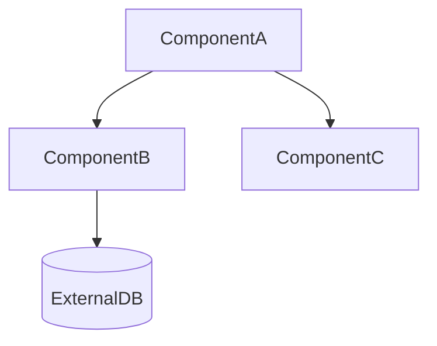
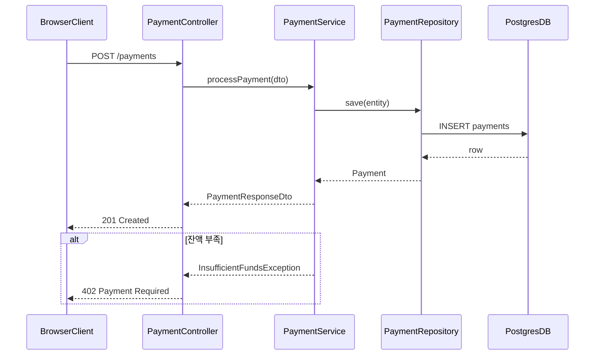

# 코드 분석 리포트 템플릿

이 파일은 `SKILL.md`의 5단계 인라인 형식에 대응하는 완전한 예시다. SKILL.md의 섹션 순서·컬럼·소항목과 정확히 일치해야 한다. 템플릿을 수정할 때는 반드시 SKILL.md 5단계도 함께 수정한다.

`[대괄호]` 안의 내용은 실제 분석 결과로 대체한다.

````markdown
---
analyzed_at: YYYY-MM-DD
scope: [분석 범위 경로]
language: [감지된 언어/프레임워크]
mode: detailed  # detailed | overview
---

# 코드 분석 리포트: [분석 대상]

---

## 섹션 1: 구조 개요

### 핵심 구성 요소

| 구성 요소 | 경로 | 역할 |
|-----------|------|------|
| ClassName / functionName | src/path/file.ext | 한 줄 역할 설명 |

### 의존성 다이어그램



노드명은 실제 클래스/모듈명을 그대로 쓴다. 외부 의존성(DB, 외부 API, 서드파티 라이브러리)은 별도 모양(`[()]`, `{}`)으로 구분한다.

### 호출 흐름

진입점에서 최종 호출 대상까지 순번 목록으로.

1. `EntryPoint.method()` → `ServiceA.process()`
2. `ServiceA.process()` → `RepositoryB.find()`
3. `RepositoryB.find()` → `Database`

---

## 섹션 2: 비즈니스 로직 분석

각 주요 기능마다 아래 4개 소항목을 **반드시 모두** 포함한다. 생략·추가 금지. 기능명은 코드에서 실제 쓰는 이름으로.

> **탈출 조항**: 본문이 빈 stub, 단순 위임 어댑터, enum/DTO record 전용, 본문 읽기 불가 같은 상황에서는 SKILL.md의 "섹션 2 탈출 조항"을 적용해 이 섹션 전체 또는 개별 기능 항목을 생략하고 **생략 사유**를 한 단락으로 기록한다. `mode: overview`에서도 동일하게 적용된다.

### [실제 기능명 1 — 예: `PaymentService.processPayment`]

- **목적**: 이 기능이 해결하는 문제
- **흐름**: 입력 → 처리 과정 → 출력
- **핵심 규칙**: 비즈니스 규칙, 조건 분기, 유효성 검증
- **데이터 흐름**: 어떤 데이터가 어디서 생성되어 어디로 전달되는지

### [실제 기능명 2]

- **목적**: ...
- **흐름**: ...
- **핵심 규칙**: ...
- **데이터 흐름**: ...

---

## 섹션 3: 시퀀스 다이어그램

주요 기능마다 시퀀스 다이어그램 1개. `participant`는 실제 코드의 클래스/모듈명을 쓴다 — `Client`, `Controller`, `Service` 같은 범용 추상명을 **라벨 없이 단독**으로 쓰지 않는다. 구체 타입이 범위 밖인 외부 호출자는 **반드시 `as "<설명>"` 보조 라벨**을 병기한다 (예: `participant Client as "HTTP Client"`, `participant Queue as "Job Queue"`). SKILL.md 섹션 3의 판정 규칙과 동일.

### [기능명] 시퀀스



분기/예외 흐름은 `alt/else` 블록으로 표현한다. 요청 `->>`와 응답 `-->>`를 일관되게 구분한다.

---

## 섹션 4: 참고 사항

순환 의존성, 사용되지 않는 심볼, 추가 분석이 필요한 지점 등 특이사항만 기록한다. 특이사항이 없으면 **이 섹션을 생략해도 된다**.

- (예) 순환 의존성: `ModuleA` ↔ `ModuleB` — 진입점 판단 시 주의 필요
- (예) `LegacyHelper.oldMethod()`는 호출처가 발견되지 않음 — 추가 조사 필요
````
