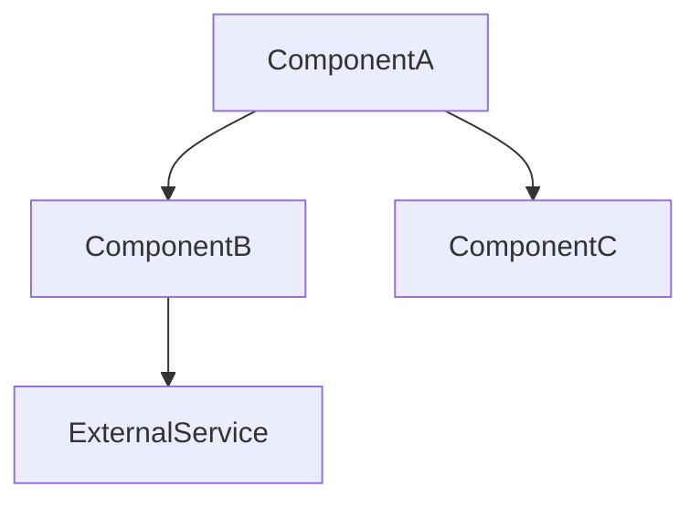
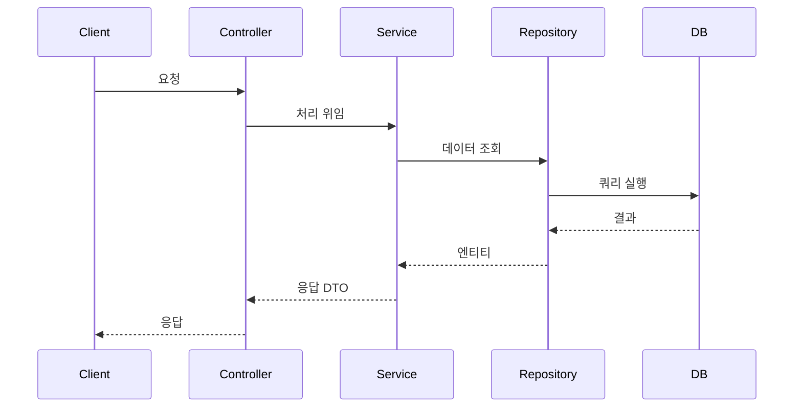

# 코드 분석 리포트 템플릿

리포트 작성 시 아래 구조를 따른다. `[대괄호]` 안의 내용은 실제 분석 결과로 대체한다.

````markdown
# 코드 분석 리포트: [분석 대상]

> 분석일: YYYY-MM-DD
> 분석 범위: [파일/모듈/프로젝트 경로]
> 언어: [감지된 언어/프레임워크]

---

## 1. 구조 개요

### 핵심 구성 요소

| 구성 요소 | 경로 | 역할 |
|-----------|------|------|
| ClassName / functionName | src/path/file.ext | 한 줄 역할 설명 |

### 의존성 다이어그램



### 호출 흐름

주요 진입점에서 시작하는 호출 순서를 요약한다.

1. `EntryPoint.method()` → `ServiceA.process()`
2. `ServiceA.process()` → `RepositoryB.find()`
3. ...

---

## 2. 비즈니스 로직 분석

### 핵심 기능 요약

각 주요 기능이 무엇을 하는지 자연어로 설명한다.

#### [기능명 1]
- **목적**: 이 기능이 해결하는 문제
- **흐름**: 입력 → 처리 과정 → 출력
- **핵심 규칙**: 비즈니스 규칙이나 조건 분기
- **데이터 흐름**: 어떤 데이터가 어디서 생성되어 어디로 전달되는지

#### [기능명 2]
- ...

---

## 3. 시퀀스 다이어그램

기능 단위로 객체 간 상호작용을 시퀀스 다이어그램으로 표현한다.

### [기능명] 시퀀스



(분석 대상에 포함된 주요 기능별로 각각 작성)

---

## 4. 참고 사항 (선택)

분석 중 발견된 특이사항, 주의할 점, 또는 추가 분석이 필요한 부분:
- (예: "이 모듈은 순환 의존성이 있어 구조 파악 시 주의 필요")
````
