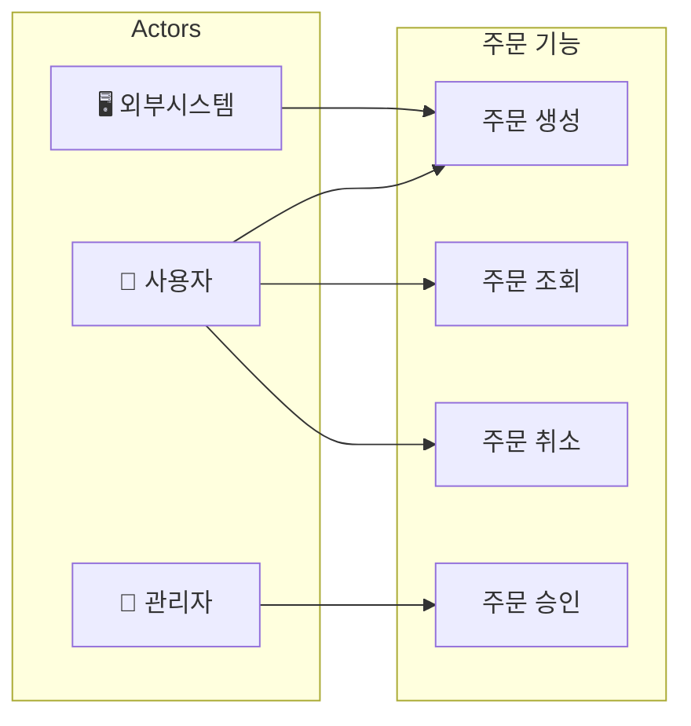
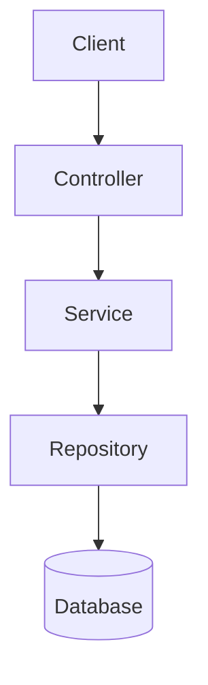
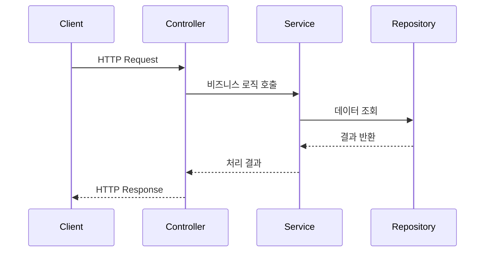
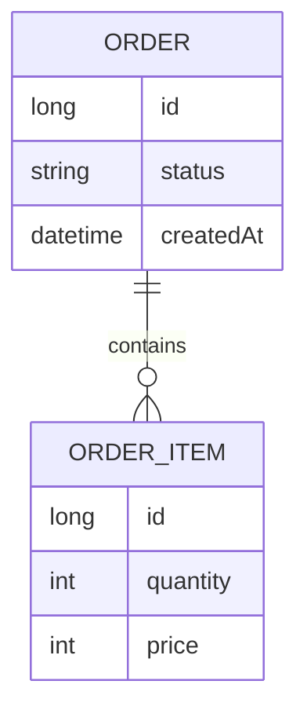

# Feature Analyzer

프로젝트 기능을 분석하여 통합 마크다운 분석서를 생성하는 스킬.

## 분석 워크플로우

### 1. 진입점 탐색

분석 대상 기능의 진입점 파일을 찾는다:

- 키워드 검색: 기능명, 클래스명, 엔드포인트 패턴
- 파일 검색: Controller, Handler, Router 등 진입점 역할 파일

### 2. 유즈케이스 파악

기능의 사용 시나리오를 분석한다:

- **액터 식별**: 사용자, 관리자, 외부 시스템, 스케줄러 등
- **주요 유즈케이스**: 액터가 시스템으로 달성하려는 목표
- **흐름 분석**:
  - 정상 흐름 (Happy Path)
  - 대안 흐름 (Alternative Flow)
  - 예외 흐름 (Exception Flow)
- **사전/사후 조건**: 기능 실행 전후 상태

### 3. 호출 체인 추적

진입점에서 시작하여 호출 흐름을 추적한다:

1. 진입점 코드 분석 → 호출하는 클래스/메서드 식별
2. 각 호출 대상으로 이동 → 다음 레이어 추적
3. 외부 시스템(DB, API, 메시지큐 등) 도달 시 추적 종료
4. 추적 중 발견한 모든 파일/클래스/메서드 기록

### 4. 의존성 수집

추적 과정에서 발견한 의존성 분류:

- **내부 모듈**: 프로젝트 내 다른 패키지/모듈
- **외부 라이브러리**: 프레임워크, 유틸리티
- **외부 시스템**: DB, 외부 API, 메시지큐

### 5. 데이터 구조 분석

기능에서 사용하는 데이터 구조 파악:

- 요청/응답 객체 (DTO, VO 등)
- 도메인 엔티티
- DB 테이블 매핑

### 6. 기술 부채 식별

분석 중 발견한 개선점 기록:

- 복잡도가 높은 메서드
- 중복 코드
- 누락된 예외 처리
- 테스트 커버리지 부족

## 산출물 템플릿

아래 구조로 통합 마크다운 파일을 생성한다:

```markdown
# [기능명] 분석서

## 1. 개요
- **기능 설명**: (기능이 하는 일 요약)
- **분석 범위**: (분석한 파일/모듈 범위)
- **분석 일자**: (작성일)

## 2. 유즈케이스

### 액터
| 액터 | 설명 |
|------|------|
| 사용자 | ... |
| 관리자 | ... |

### 유즈케이스 목록
| ID | 유즈케이스 | 액터 | 설명 |
|----|-----------|------|------|
| UC-01 | ... | ... | ... |

### 유즈케이스 다이어그램
(Mermaid로 액터-유즈케이스 관계 표현)

### 상세 시나리오: [주요 유즈케이스명]
- **사전 조건**: ...
- **정상 흐름**:
  1. ...
  2. ...
- **대안 흐름**: ...
- **예외 흐름**: ...
- **사후 조건**: ...

## 3. 아키텍처 개요
(전체 구조를 설명하는 Mermaid Flowchart)

## 4. 호출 흐름
(요청 처리 순서를 보여주는 Mermaid Sequence Diagram)

## 5. 구성 요소
| 레이어 | 파일/클래스 | 역할 |
|--------|-------------|------|
| ... | ... | ... |

## 6. 데이터 흐름
(Entity/DTO 관계를 보여주는 Mermaid ERD 또는 Class Diagram)

## 7. 의존성
### 내부 모듈
- ...
### 외부 라이브러리
- ...
### 외부 시스템
- ...

## 8. 개선 포인트
| 위치 | 이슈 | 제안 |
|------|------|------|
| ... | ... | ... |
```

## Mermaid 다이어그램 가이드

### Use Case Diagram



### Flowchart (아키텍처)



### Sequence (호출 흐름)



### ERD (데이터 구조)



## 프레임워크별 가이드

Spring Boot 프로젝트 분석 시 `references/spring-boot-guide.md` 참조.
