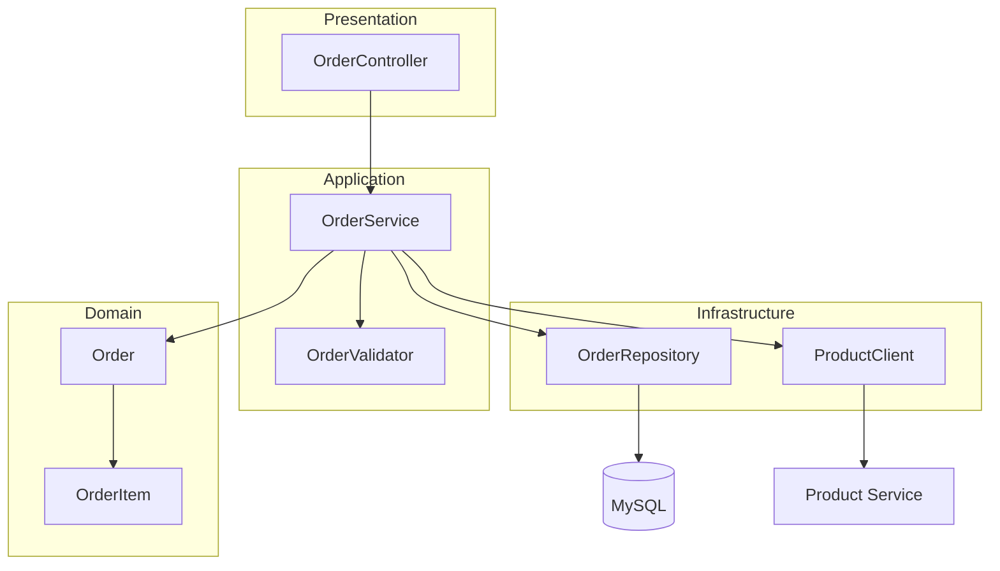
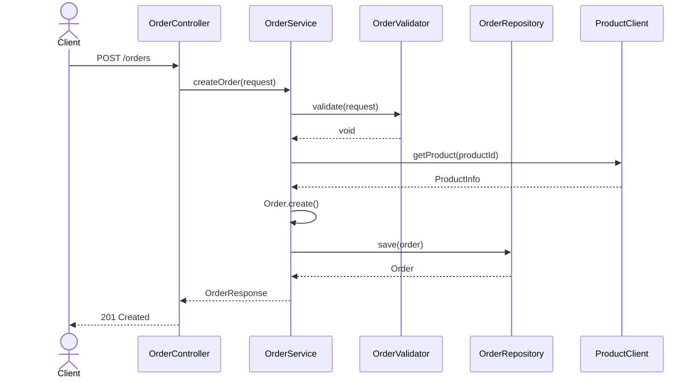

# 주문 기능 분석서

> 분석 레벨: **Standard**

## 1. 개요

- **기능 설명**: 고객이 상품을 주문하고, 주문 내역을 조회/취소할 수 있는 기능
- **분석 범위**: `order` 패키지 전체 (`controller`, `service`, `repository`, `domain`)
- **분석 일자**: 2024-01-15

## 2. 아키텍처 개요

## 3. 호출 흐름

### 주문 생성 (POST /orders)

## 4. 구성 요소

| 레이어 | 클래스 | 역할 |
|--------|--------|------|
| Controller | `OrderController` | HTTP 엔드포인트 (`/orders`) |
| Service | `OrderService` | 주문 생성/조회/취소 비즈니스 로직 |
| Service | `OrderValidator` | 주문 요청 유효성 검증 |
| Domain | `Order` | 주문 엔티티 (Aggregate Root) |
| Domain | `OrderItem` | 주문 항목 엔티티 |
| Domain | `OrderStatus` | 주문 상태 enum |
| Repository | `OrderRepository` | 주문 데이터 접근 |
| DTO | `CreateOrderRequest` | 주문 생성 요청 |
| DTO | `OrderResponse` | 주문 응답 |

## 5. 의존성

### 내부 모듈
- `common.exception`: 공통 예외 클래스
- `product.client`: 상품 서비스 클라이언트

### 외부 라이브러리
- Spring Web (`@RestController`, `@RequestMapping`)
- Spring Data JPA (`JpaRepository`)
- Lombok (`@RequiredArgsConstructor`, `@Builder`)

### 외부 시스템
- **MySQL**: 주문 데이터 저장
- **Product Service**: 상품 정보 조회 (HTTP)

---

*Generated by feature-analyzer skill*
